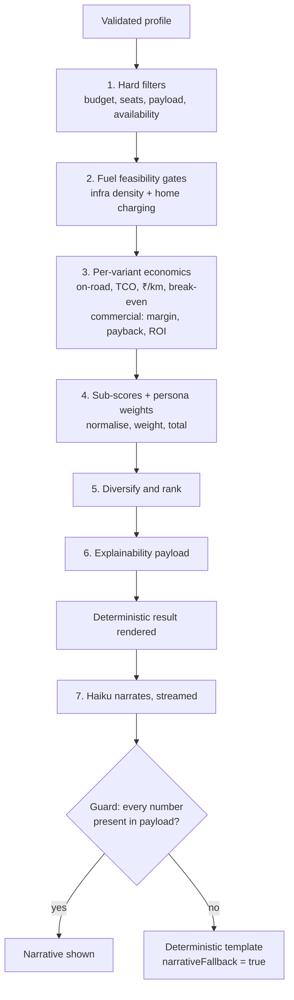
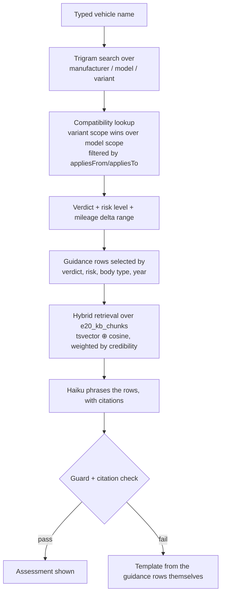

# Carbon Miles — System Architecture

Status: draft for MVP · Last reviewed: 2026-08-23

Related: [PRD.md](./PRD.md) · [DATA-MODEL.md](./DATA-MODEL.md)

---

## 1. The one rule

> **Deterministic engine first. LLM last, and only for language.**

Everything else in this document follows from that sentence. The product does no
live web search at conversation time; all vehicle facts come from Postgres, all
economics come from TypeScript, and Claude Haiku only turns already-computed
numbers into prose.

| Job | Who does it |
|---|---|
| Filter candidates, compute TCO/ROI/CO₂, score, rank, compare | TypeScript + SQL. No LLM. |
| Narrate a scored result set | Haiku, from the explainability payload only |
| Parse free text into a structured profile | Haiku, strict-schema tool call |
| E20 verdict, mileage-delta range, risk level | Rules table + compatibility data. No LLM. |
| E20 guidance prose | Haiku over retrieved KB chunks, with citations |

The reason to be this strict is not purity. It is that a deterministic engine is
testable against golden fixtures, reproducible months later, cheap to run a
million times, and defensible when a user asks why. None of those are true of a
model asked to reason about money.

### 1.1 When an LLM is *not* allowed

- Producing, adjusting or rounding any number.
- Retrieving a vehicle specification. Specs come from the catalogue tables; RAG
  is confined to `e20_kb_chunks`.
- Deciding a ranking, a verdict, a risk level, or which guidance applies.
- Filling a gap in the data. `unknown` is a valid, shippable answer.

### 1.2 The guard

Anything the model emits is validated against the payload it was given. A number
in the output that is absent from the input payload fails the response and falls
back to a deterministic template, with `narrativeFallback = true` recorded on the
run and `guardRejected = true` on the `llm_calls` row.

This is the load-bearing safety property of the product. Preserve it.

## 2. Stack

| Layer | Choice | Why this one |
|---|---|---|
| Framework | Next.js 16 (App Router) | Server Components put the engine next to the database; streaming is native |
| Runtime | Node.js on Vercel Fluid Compute | Full Node APIs, instance reuse, 300 s ceiling, no Edge compatibility tax |
| Database | Neon Postgres (Vercel Marketplace) | Branching for migrations, scale-to-zero for a pre-revenue product, `pgvector` and `pg_trgm` available |
| ORM | Drizzle | SQL-shaped, no runtime query builder overhead, schema is the source of truth for migrations |
| Driver | `postgres-js`, module-scoped pool | Correct under Fluid Compute, which shares instances across concurrent requests |
| AI | Vercel AI Gateway + AI SDK v7 → Claude Haiku | One integration point for streaming, retries, fallback and cost accounting |
| Validation | zod v4 | The profile schema is also the LLM tool schema — one definition, both jobs |
| UI | React 19, Tailwind v4, Base UI + shadcn | Accessible primitives without a component-library lock-in |
| Files | Vercel Blob | PDF reports and archived raw ingestion documents |
| Tests | Vitest (unit, golden fixtures), Puppeteer (E2E) | Engine tested as pure functions; journeys tested as journeys |

Node 24 in CI. `pnpm` for everything.

## 3. Layout

```
src/
  app/            Next.js App Router — routes, layouts, server actions
  components/     UI. Presentational; no engine logic, no database access.
  db/
    client.ts     module-scoped pool + drizzle instance
    schema/       nine modules, 38 tables (see DATA-MODEL.md)
    seed/         diff-based seed modules and runner
  lib/
    engine/       pure functions. No database access. Golden-fixture tested.
    ai/           prompts, schemas, the guard, cache keys
    data/         query functions — the only place that touches `db`
drizzle/          generated migrations
scripts/          .mts entry points (seed, verify)
docs/             this directory
```

The `src/lib/` subdirectories are the target layout; they are created as their
epics land. `src/db/` and `scripts/` exist today.

The boundary that matters: **`src/lib/engine/` never imports `src/db/`.** The
engine takes plain data in and returns plain data out, so it can be run against
fixtures with no database at all. Query functions in `src/lib/data/` fetch the
inputs; route handlers wire the two together.

## 4. Journey A request flow



Stages 1–6 are synchronous, pure, and complete before anything is sent to a
model. Stage 7 streams over an already-rendered result — the page is useful with
the narrative disabled, which is both a resilience property and a cost lever.

### 4.1 Stage detail

1. **Hard filters.** SQL against `vehicle_variants`, served by
   `vehicle_variants_candidate_idx` (fuel type, ex-showroom, seating capacity,
   partial on `status = 'active'`) or `vehicle_variants_price_idx` when the
   profile does not pin a fuel type. Budget is compared against *on-road* price,
   so `state_on_road_factors` is joined here, not later.
2. **Feasibility gates.** `infra_density` for the user's city, by station type.
   A gate that excludes a powertrain records its reason; exclusions are shown to
   the user, never applied silently.
3. **Economics.** Pure functions over the variant plus the reference tables:
   fuel prices, electricity tariffs, maintenance curves, resale curves, battery
   costs, finance rates, emission factors. All arithmetic in paise, integers.
4. **Scoring.** Each sub-score (cost, usage fit, infrastructure, environment,
   reliability, practicality) is normalised across the candidate set, then
   weighted by persona. Commercial personas weight ₹/km and payback; passenger
   personas weight on-road price and running cost.
5. **Diversify and rank.** Cap variants per model, ensure fuel-type spread among
   feasible options, then take the top N.
6. **Explainability payload.** Every input, intermediate, weight and source that
   produced each score. This payload is what the API returns, what the UI
   renders, and the *only* thing the model is shown.

## 5. Journey B request flow



The verdict is never generated. It is read. If there is no row, the answer is
`unknown` and the UI says so. Where the verdict came from the BS-VI phase 2 rule
rather than an OEM statement, `inferredFromNorm` is surfaced in the UI wording.

### 5.1 Retrieval

`e20_kb_chunks` is the only RAG surface in the product. Retrieval is hybrid:
Postgres full-text search over an expression index on `title || content`, fused
with cosine similarity over a 1536-dimension HNSW-indexed embedding, pre-filtered
by tag through a GIN index. Corpus size is small enough that lexical search alone
often suffices; fusing the two keeps recall high without adding a second store.

Chunk `credibility` (0–100) weighs a peer-reviewed study above a forum post at
fusion time. Every chunk resolves to a `sources` row, which is what makes
citations possible.

## 6. Caching

Three layers, cheapest first.

| Layer | Key | Invalidated by |
|---|---|---|
| Reference data | table name | Daily refresh job; `economics_refresh_log` records it |
| Narrative | bucketed profile (`recommendation_runs.profileBucket`) + ranked variant id set | Catalogue change to any variant in the set; engine version bump |
| HTTP | route + profile hash | `updateTag` on catalogue and engine-version tags |

Profile bucketing is what makes the narrative cache viable: two users with
₹9.2 L and ₹9.4 L budgets in the same city with similar running are the same
question, and should be the same answer. Bucket boundaries are engine inputs and
therefore versioned — a bucketing change is an engine version change.

The deterministic result is *not* cached across users beyond the reference-data
layer. It is cheap to recompute and stale numbers are worse than a few extra
milliseconds.

## 7. Ingestion architecture

Batch, offline, human-gated. Nothing here runs during a user request.

```
scrape_jobs → raw_documents (archived to Blob, content-hashed)
            → staging_records (parsed candidates + validation flags + diff)
            → review_queue (pending → approved / rejected / auto_approved)
            → live catalogue + fact_provenance + data_change_log
```

Four properties that are deliberate:

- **Archive before parse.** Every published fact can be re-derived from the exact
  bytes it came from. That is the difference between an auditable catalogue and
  one we merely hope is right.
- **Nothing reaches live without a decision.** Auto-approval is a recorded
  decision, not an absence of one.
- **The crawl boundary lives in code.** `sources.crawlAllowed` gates fetching.
- **Source tier gates publication.** The pipeline refuses to publish a fact whose
  best source sits below the tier required for that field — an ex-showroom price
  needs OEM or government; an editorial pro/con list does not.

Seeding is a separate, simpler path: `src/db/seed/` modules read what is already
there and apply only the delta, in one transaction, never deleting rows the seed
no longer mentions. A seed file is a floor, not a mirror.

## 8. Scale and cost

The load target is 1,000,000 recommendation requests and 100,000 users.

- **Reads dominate and are indexed.** The candidate filter is one indexed scan
  over a table that holds hundreds — not millions — of rows. The catalogue is
  small by design; depth comes from the reference tables, which are smaller.
- **Fluid Compute reuses instances**, so the module-scoped pool is amortised
  across concurrent requests rather than re-established per invocation. The pool
  is capped at 5 per instance because Neon's pooled endpoint fans out on its
  side.
- **Neon scales to zero** between traffic, which is the right shape for a
  pre-revenue product with bursty usage.
- **LLM cost is the only variable that grows linearly with usage**, which is why
  it is capped by bucketed caching, a small output budget, and prompt caching on
  the static instruction block — and why every call is metered into `llm_calls`.

If the catalogue grows past the point where the candidate filter stops being
trivial, the fix is a materialised view of active variants joined to their
segment curves, not a different database.

## 9. Failure modes and degradation

| Failure | Behaviour |
|---|---|
| AI gateway unavailable or slow | Deterministic result already rendered; narrative falls back to template |
| Guard rejects the narrative | Template served, `narrativeFallback = true`, alert if the rate exceeds 2% |
| Reference table stale | Figures still render with their `asOf` date; staleness surfaced in the assumptions panel |
| No compatibility data for a vehicle | `unknown` verdict, stated plainly, with a prompt to check the owner's manual |
| Feasibility gate excludes everything | Return the excluded set with reasons rather than an empty screen |
| Database unreachable | Hard failure. There is no cached-catalogue mode, and pretending otherwise would ship wrong numbers |

The pattern throughout: degrade the *language*, never the *numbers*.

## 10. Observability

- `llm_calls` — per-call tokens, micro-USD cost, latency, cache hit, guard
  rejection. Unit economics are the premise of this product, so they are measured.
- `recommendation_runs` — profile, engine version, candidate count, full ranked
  breakdown, latency. A run is reproducible long after the catalogue has moved on.
- `feedback.disputedVariantId` — the fastest signal that the weighting is wrong.
- `economics_refresh_log` and `scrape_jobs` — data freshness and pipeline health.
- `audit_log` and `data_change_log` — who changed what, on whose say-so.

Alert on: guard rejection rate, narrative cache hit rate, p95 engine latency,
reference-table staleness, and cost per run.

## 11. Security

- OTP codes and session tokens are stored hashed; a database read cannot be
  replayed as a login.
- Report share links use an unguessable token with its own expiry, independent of
  the user's session.
- Admin access is role-gated at the route level, and every mutation writes an
  `audit_log` row.
- `DATABASE_URL` comes from Neon via the Vercel Marketplace and is pulled with
  `vercel env pull .env.local`. It is never committed.
- The engine makes no outbound network calls. The only egress is the database and
  the AI gateway.

## 12. Conventions that bite

Carried here from `CLAUDE.md` because they are architectural, not stylistic:

- **Money is paise, stored as `bigint`.** ₹50 L is 5×10⁹ paise — past int32 — and
  float rupees drift once compounded over a ten-year horizon.
- **Never calculate from claimed figures.** `claimed*` columns are display-only.
- **Drizzle uses `casing: "snake_case"`** in both `drizzle.config.ts` and the
  client. Keep both in sync or generated SQL drifts.
- **`CREATE EXTENSION` is hand-added** to `drizzle/0000_init.sql`; drizzle-kit
  does not emit it. Re-check after regenerating a baseline.
- **No `export *` in files under `src/` that an `.mts` script imports.** The
  package has no `"type": "module"`, so those files transpile to CommonJS and a
  star re-export becomes a runtime call Node's ESM lexer cannot see.
- **This is Next.js 16.** Read `node_modules/next/dist/docs/` rather than working
  from memory.
